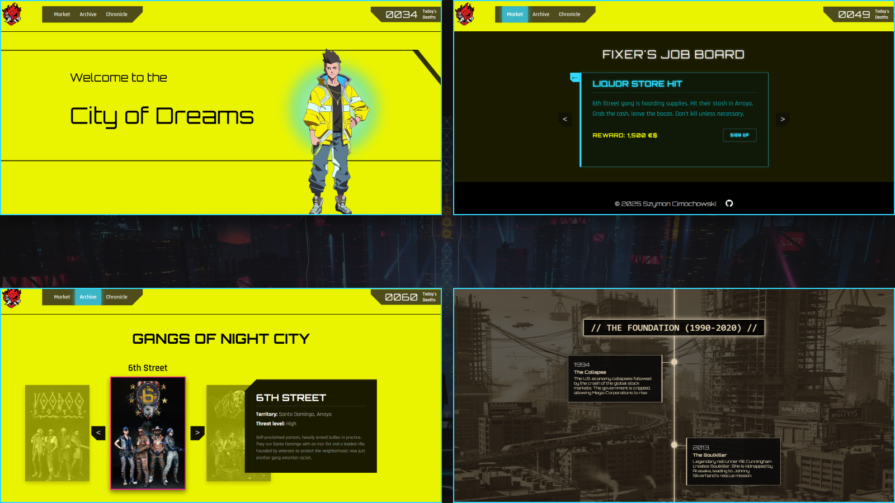

# Cyber-Codex: Your Path to Night City

> "Welcome to the City of Dreams."

**Cyber-Codex** is an immersive, interactive web experience dedicated to the lore of the *Cyberpunk* universe (2077/Edgerunners). This project demonstrates advanced front-end development skills using pure **HTML, CSS, and JavaScript**, with a strong focus on UI/UX design, animations, and performance.

🔗 **Live Demo:** [View Cyber-Codex on GitHub Pages](https://szymmix.github.io/Cyber-Codex/)



---

## 🎨 Design & Prototyping: From Concept to Code

This project is a complete product built from scratch, not a template.

*   **Original UI/UX Design:** Designed entirely in **Figma** before writing a single line of code.
*   **Figma to Code:** Transformed the static visual concept into a living, responsive website, adapting the layout to work seamlessly across different screen sizes.


---

## ⚡ Key Features

This project was built without any CSS/JS frameworks to demonstrate mastery of core web technologies.

### 🏠 **Home Page (Storytelling)**
*   **Scrollytelling Animation:** A cinematic "sticky" scroll sequence (The Moon Scene) using CSS `position: sticky` and JavaScript to calculate scroll progress.
*   **Typewriter Terminal:** A JavaScript-driven terminal outro with typing effects and blinking cursors.
*   **Parallax & Glow Effects:** Custom CSS animations (`@keyframes`) for breathing neon glows.

### 🛒 **Market (The App)**
*   **SPA-like Architecture:** Dynamic view switching (Selection -> Job Board -> Form) within a single HTML file using DOM manipulation.
*   **Data Injection:** Job listings are stored in JavaScript objects and rendered dynamically based on user selection (Streetkid vs. Corpo).
*   **Form Validation:** Custom logic to validate "Netrunner IDs" (email format) with immersive, terminal-style error messages.

### 📂 **Archive (The Gallery)**
*   **3D Carousel:** A custom-built 3D slider for Gangs using CSS `perspective` and `transform: rotateY/translateZ`.
*   **Dynamic Content:** Changing the slide automatically updates the descriptive text and stats via JavaScript.
*   **CSS Grid:** Responsive grid layouts for District surveillance feeds.

### 📜 **Chronicle (The Timeline)**
*   **Intersection Observer API:** The timeline utilizes `IntersectionObserver` to detect which Era is currently on screen.
*   **Dynamic Theming:** As the user scrolls, the entire website's theme (backgrounds, accent colors, borders) changes dynamically to match the era (e.g., Sepia for *The Foundation*, Red for *Corporate Wars*).
*   **Scroll Progress:** A custom progress bar that draws itself as the user reads through history.

### 🔧 **Global Features**
*   **Persistent State:** The "Death Counter" in the header simulates real-time data and saves its state to **sessionStorage**.
*   **RWD (Responsive Web Design):** Fully optimized for Desktop, Tablet, and Mobile devices using Media Queries.
*   **Cyberpunk UI:** Custom `clip-path` shapes (chamfered corners), neon glows, and custom fonts (Orbitron, Rajdhani, VT323).

---

## 🛠️ Tech Stack

*   **HTML5:** Semantic markup, SEO optimization (Open Graph, Twitter Cards).
*   **CSS3:** 
    *   CSS Variables (Custom Properties) for dynamic theming.
    *   Flexbox & Grid layouts.
    *   Advanced animations (`@keyframes`) & Transitions.
    *   `clip-path` for custom UI shapes.
*   **JavaScript (ES6+):**
    *   DOM Manipulation.
    *   `IntersectionObserver` API.
    *   `sessionStorage` API.
    *   Event Handling & Logic separation.
*   **Tools:** Figma (UI Design), VS Code, Git/GitHub.

---

## 📂 Project Structure

```text
Cyber-Codex/
├── assets/
│   ├── css/
│   │   └── style.css       # Main stylesheet (Variables, Global, RWD)
│   ├── js/
│   │   └── main.js         # Core logic (Safe navigation guards for each page)
│   └── images/
│       ├── home/           # Hero & Scrollytelling assets
│       ├── market/         # Faction assets
│       ├── archive/        # Gallery assets
│       │   ├── gangs/      # Carousel images
│       │   └── districts/  # Surveillance feed images
│       └── chronicle/      # Era backgrounds
├── index.html              # Home Page
├── market.html             # Faction Selection & Job Board
├── archive.html            # Database & Gallery
├── chronicle.html          # Interactive Timeline
└── README.md               # Project Documentation
```
---

## 🚀 Getting Started

To run this project locally:

1.  **Clone the repository:**
    ```bash
    git clone https://github.com/SZYMMIX/Cyber-Codex.git
    ```
2.  **Open the project folder.**
3.  **Launch:** Open `index.html` in your browser (or use VS Code "Live Server" extension for the best experience).

---

## 🎨 Credits & Assets

*   **Design Inspiration:** CD Projekt Red (*Cyberpunk 2077*, *Cyberpunk: Edgerunners*).
*   **Fonts:** Google Fonts (Orbitron, Rajdhani, VT323).
*   **Images:** Official artworks and screenshots from the game/anime.
*   **Wiki Data:** Text content based on the [Cyberpunk Wiki](https://cyberpunk.fandom.com/).

---

<div align="center">
  
  <br>
  
  **Created by Szymon Cimochowski**
  
  *Built for the dark future.*
  
</div>
